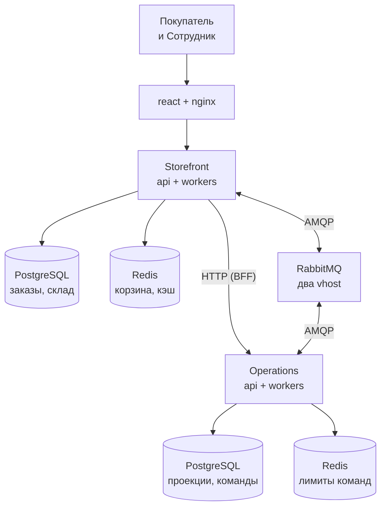

# Asian Restaurant

Заказ еды в паназиатском ресторане: витрина с меню, серверная корзина и оформление заказа, история заказов
покупателя и панель сотрудника, в которой заказ проходит свои статусы.

Два Django-сервиса и React SPA:

- **storefront** (`backend/`) владеет покупателями, меню, складом, корзинами и заказами. Он отдает публичное
  API, Django admin и API панели сотрудника и единственный изменяет заказ.
- **Operations** (`services/order_operations/`) строит свои проекции заказов, покупателей и склада и ведет
  жизненный цикл команд сотрудника. В базу storefront он не обращается.
- **frontend** (`frontend/`) - React SPA для покупателей и сотрудников, ее раздает nginx.

Публичного хостинга пока нет: все, что описано ниже, запускается локально или на одноразовых стендах Docker
Compose. TLS завершает ingress перед nginx, и это требование будущего развертывания, а не работающий компонент
(см. [DEPLOY.md](DEPLOY.md)).

## Стек

| Слой | Технологии |
|---|---|
| Фронтенд | React 18, TypeScript, Vite, Tailwind CSS 4, TanStack Query, Zustand |
| Бэкенд | Python 3.13, Django 5.2, django-ninja, gunicorn с воркерами uvicorn |
| Хранилища | PostgreSQL 16 и Redis 7, у каждого сервиса свои |
| Сообщения | RabbitMQ 4.3, два vhost, transactional outbox в обоих сервисах |
| Инфраструктура | Docker Compose, nginx, Prometheus |
| Проверки | pytest, ruff, `node --test`, lock-файлы uv, GitHub Actions, гейт production-рендера, Compose-смоуки |

## Архитектура



Storefront - это `backend` (API, админка и BFF панели сотрудника) и фоновые процессы `relay` и
`commands-consumer`. Operations - это `operations-api` и процессы `commands-relay`, `operations-bridge` и
`operations-consumer`. Базы друг друга сервисы не читают: storefront вызывает Operations по HTTP, остальное идет
через RabbitMQ, где у каждого сервиса свой vhost. Из Operations в vhost `storefront` ходят только
`commands-relay` и `operations-bridge`, каждый со своими ограниченными правами. Источник истины для заказов и
склада - база storefront, брокер только переносит сообщения из outbox к потребителям.

**События**, от storefront к Operations:

1. Изменение заказа, склада, покупателя или роли сотрудника записывается в `OrderOutbox` в той же транзакции,
   что и само изменение.
2. `relay` публикует строки outbox в vhost `storefront` с подтверждением брокера, события одного агрегата строго
   по порядку.
3. `operations-bridge` переносит их в vhost `operations` в версионированном формате, `operations-consumer`
   обновляет проекции.

**Команды**, от панели к заказу:

1. Панель отправляет смену статуса в storefront. BFF выпускает короткоживущий JWT, создает команду в
   `operations-api` и отвечает `202` с id команды (`200` с той же командой на повтор ключа).
2. `commands-relay` публикует команду из outbox Operations в обмен `commands` vhost `storefront`.
3. `commands-consumer` под блокировкой заказа проверяет сотрудника и ожидаемый статус, меняет статус и в той же
   транзакции пишет исход в `OrderOutbox`.
4. Исход возвращается в Operations путем событий, и `operations-consumer` завершает команду. Панель все это время
   следит за статусом команды: подтверждение приходит асинхронно, а не в ответе на запрос.

## Заказ: от корзины до подтверждения

1. Покупатель с аккаунтом оформляет серверную корзину. Сначала, вне транзакции, адрес проверяет геокодер с кешем:
   если адрес не найден или геокодер недоступен, заказ создается с непроверенным адресом. Затем в одной транзакции
   storefront остатки списываются под блокировкой строк и создаются заказ и строка `order.created` в
   `OrderOutbox`. Повтор с тем же ключом идемпотентности или с той же версией корзины возвращает уже созданный
   заказ, если данные формы те же, и отвечает 409 `checkout_replayed` с номером заказа, если их изменили. SPA держит
   один ключ, пока открыта форма оформления. Заказ, записанный до сбоя очистки корзины, все равно возвращается как
   оформленный: он помечен как не вычтенный из корзины, и купленное вычитает следующее обращение к корзине или
   следующее оформление, один раз и до слияния гостевой корзины и любой записи. Оформления одного покупателя
   коммитятся по очереди, и снимок корзины, прочитанный до коммита другого его заказа, получает 409 `cart_changed`
   вместо повторной покупки. У заказов прошлой версии отметки нет, и их корзина очищается, только пока она
   совпадает со снимком заказа по версии и составу.
2. Событие доходит до проекций Operations путем, описанным выше.
3. Сотрудник подтверждает заказ. Для сотрудника на командном контуре это путь команды, для остальных - прямая
   смена статуса в storefront под той же блокировкой и проверкой `expected_status`, поэтому оба пути могут
   сосуществовать на одном заказе и не применяются дважды.
4. Каждая смена статуса - новая версия агрегата заказа, она уходит в Operations так же, как в шаге 2.

## Команды: идемпотентность и состояния

- Одно действие сотрудника - один `Idempotency-Key`. Operations различает команду по
  `(сотрудник, тип команды, заказ, ключ)`: повтор возвращает существующую команду, тот же ключ с другим
  намерением получает `409`. BFF storefront состояния повторов не хранит
  ([ADR-0002](packages/event_contracts/docs/ADR-0002-bff-retry-state.md)).
- Новые команды ограничены в Redis Operations на сотрудника и на пару сотрудник-заказ. Повтор лимит не
  расходует, отказ - `429` с `Retry-After`, а без хранилища лимитов новая команда получает `503`.
- `pending` и `dispatched` - команда в пути, `succeeded` и `rejected` - окончательные. `timed_out` и
  `dispatch_failed` не окончательные: поздний исход еще может завершить команду, иначе решение принимает оператор
  через `resolve_command` ([runbook-0008](services/order_operations/docs/runbook-0008-command-plane.md)).
- Панель хранит незавершенное действие с его ключом в браузере и после потерянного ответа или перезагрузки
  предлагает продолжить его тем же ключом.

Полный дизайн командного контура - [ADR-0001](packages/event_contracts/docs/ADR-0001-order-transition-command-plane.md).

## Роли и доступ

| Роль | Доступ |
|---|---|
| покупатель | своя корзина, оформление заказа, своя история заказов |
| `restaurant_operator` | очередь заказов и смена статусов |
| `restaurant_manager` | доступ оператора, склад и данные покупателей |
| суперпользователь | все, и только он выдает штатные роли |

- Покупатель регистрируется по коду из SMS: `POST /api/auth/register/code` отправляет код, `POST /api/auth/register`
  создает аккаунт только с ним. Код живет 10 минут и дает 5 попыток, новый можно запросить через минуту и не
  больше 5 раз в сутки, хранится только его HMAC. Ответ и лимиты одинаковы для свободного и занятого номера,
  владельцу занятого приходит SMS о попытке. Пароль восстанавливается так же, через `/api/auth/password/code` и
  `/api/auth/password/reset`, и остальные сессии аккаунта при этом заканчиваются. Аккаунт сотрудника по SMS не
  восстанавливается, его пароль меняет администратор (`manage.py changepassword`).
- Сотрудник держит ровно одну роль: две группы сразу закрывают доступ, а не расширяют его. `is_staff` сам по
  себе ничего не дает. Каждое изменение роли пишется в `EmployeeRoleAudit`.
- Storefront подписывает JWT сотрудника для Operations. Operations проверяет подпись по JWKS storefront и
  принимает токен, только если его `authz_version` совпадает с проекцией сотрудника в Operations. Отзыв роли
  повышает версию, и токен, выпущенный раньше, отклоняется, когда событие отзыва дошло до проекции; до этого
  внешняя граница - срок жизни токена (`IDENTITY_JWT_TTL`, по умолчанию 600 с). Изменить заказ такой токен не
  может и в этом окне: `commands-consumer` перепроверяет роль и версию сотрудника в базе storefront.
- Панель не держит токен Operations, BFF выпускает его на каждый вызов. `POST /api/auth/employee-token` пока
  выдает токен вошедшему сотруднику для прямого доступа к Operations; оставлять ли его - открытое решение.
- `transitions_via_commands` переводит сотрудника на командный контур. Прямой эндпоинт смены статуса и действия
  в админке для него закрываются, а панель, открытая до переключения, узнает об этом из
  `403 transition_mode_changed`.

## Быстрый старт

Нужны Docker с Compose v2, bash и openssl (на Windows подходит Git Bash). Для проверок фронтенда вне Docker -
Node.js 22+, для Python-инструментов - [uv](https://docs.astral.sh/uv/).

```bash
cp .env.example .env
cp compose.override.example.yaml compose.override.yaml
bash scripts/dev_gen_jwt_key.sh
docker compose up -d --build
```

Override запускает backend через `runserver`, а фронтенд через Vite, оба с подключенными исходниками. Миграции
выполняют одноразовые `storefront-migrate` и `operations-migrate` под ролью мигратора, процессы подключаются к
базам под runtime-ролью, как в production. Bootstrap-пользователь только создает роли, и провижининг отказывает,
пока под ним открыты сессии; поэтому повторный `docker compose up -d` на работающем стеке проходит и применяет
новые миграции. Dev-стек запускает еще `ops`, устаревшего потребителя проекций storefront, которого production
не запускает.

```bash
# каталог и начальные остатки, один раз на новой базе
docker compose exec backend python manage.py seed_menu
docker compose exec backend python manage.py seed_initial_stock --confirm --quantity 50

# суперпользователь, который выдает штатные роли
docker compose exec backend python manage.py createsuperuser --username +380671112244
```

Сотрудник регистрируется на сайте как покупатель, здесь с телефоном `+380671112233`, и получает роль. Код из
SMS в dev не отправляется, а пишется в лог backend: `docker compose logs backend | grep "sms to"`.

```bash
docker compose exec backend python manage.py grant_employee +380671112233 --role restaurant_manager --actor +380671112244
# по желанию: перевести его на командный контур
docker compose exec backend python manage.py transitions_via_commands +380671112233
```

| Что | Где |
|---|---|
| Витрина и панель сотрудника | http://localhost:5173 |
| Документация API (только в dev) | http://localhost:8000/api/docs |
| Django admin | http://localhost:8000/admin/ |
| RabbitMQ management | http://localhost:15672 |
| Prometheus | http://localhost:9090 |

## Тесты

```bash
# фронтенд: типы, юнит-тесты сценария команд, production-сборка
cd frontend && npm ci --no-audit && npm run lint && npm test && npm run build && cd ..

# аудит зависимостей фронтенда, как в CI: запрос к базе уязвимостей npm, high и critical дают ошибку
cd frontend && npm audit --audit-level=high && cd ..

# общие контракты событий
cd packages/event_contracts && uv sync --locked && uv run --locked pytest -q && cd ../..

# storefront в запущенном dev-стеке: тесты создают свою базу, это может только bootstrap-пользователь из .env
docker compose exec backend sh -c 'DATABASE_URL="postgres://$POSTGRES_USER:$POSTGRES_PASSWORD@db:5432/$POSTGRES_DB" pytest'

# Operations в отдельном проекте с уникальным именем на каждый запуск: dev-образ с подключенными исходниками
P="asian-restaurant-ops-test-$(openssl rand -hex 8)"
docker compose -p "$P" -f compose.yaml -f compose.test.yaml up -d --build operations-api
docker compose -p "$P" -f compose.yaml -f compose.test.yaml exec operations-api pytest
docker compose -p "$P" -f compose.yaml -f compose.test.yaml down -v
```

Тестовый оверлей не запускают в проекте dev-стека: он пересоздал бы `operations-api` и брокер без dev-override.
Последняя команда удаляет тома только проекта, созданного первой.

Гейт production-рендера и одноразовые стенды, каждый в своем Compose-проекте:

```bash
bash scripts/check_prod_config.sh             # гейт production-рендера
bash scripts/stack_smoke.sh                   # nginx, prometheus, сети и командный контур на выпущенном стеке
bash scripts/release_upgrade_smoke.sh         # два релиза подряд по DEPLOY.md; занимает 127.0.0.1:80 и :9090
bash scripts/restore_rehearsal.sh             # копия в окне обслуживания и восстановление в пустой стек
E2E_ALLOW_DESTRUCTIVE=1 bash scripts/e2e_reconcile.sh
```

CI прогоняет Python-наборы через `uv sync --locked` на настоящих PostgreSQL, Redis и RabbitMQ, проверки
фронтенда, гейт, тест прав издателя команд, production-bootstrap брокера, смоуки ролей баз, пула Operations,
стека и второго релиза: [.github/workflows/ci.yml](.github/workflows/ci.yml). Репетиция восстановления и e2e
запускаются только локально.

## Структура

```
.
├── backend/                  # storefront: Django-проект
│   ├── accounts/             # пользователи, штатные роли, аудит, JWT сотрудника
│   ├── menu/                 # каталог, склад, корректировки остатков
│   ├── cart/                 # серверная корзина в Redis
│   ├── orders/               # checkout, заказы, геокодер, outbox, потребитель команд
│   ├── employee/             # API панели сотрудника и BFF команд
│   ├── ops/                  # устаревшая проекция заказов, только dev-стек
│   ├── config/               # настройки, корень API, воркеры
│   └── seed/                 # данные меню и фото блюд с их sha256
├── services/order_operations/  # Operations: проекции, API команд, relay, bridge
├── packages/event_contracts/ # контракты событий и команд обоих сервисов
├── frontend/                 # React SPA и конфиг nginx
├── ops/                      # роли postgres, провижининг rabbitmq, prometheus, ключи identity
├── scripts/                  # гейт production, смоуки, репетиция восстановления
├── compose.yaml              # стек
├── compose.prod.yaml         # production-оверлей
├── compose.override.example.yaml  # шаблон dev-оверлея
└── DEPLOY.md                 # релиз, секреты, модель сетей, копия и восстановление
```

## Документация

- [DEPLOY.md](DEPLOY.md) - порядок релиза, секреты, роли баз, требования к ingress, модель сетей, копия и
  восстановление, закрепление образов.
- [ADR-0001](packages/event_contracts/docs/ADR-0001-order-transition-command-plane.md) - командный контур смены
  статуса заказа.
- [ADR-0002](packages/event_contracts/docs/ADR-0002-bff-retry-state.md) - почему BFF не хранит состояние
  повторов.
- [runbook-0008](services/order_operations/docs/runbook-0008-command-plane.md) - команды, которым нужен оператор.
- [services/order_operations/README.md](services/order_operations/README.md) - сервис Operations.
- [ops/rabbitmq/README.md](ops/rabbitmq/README.md), [ops/identity/README.md](ops/identity/README.md) - провижининг
  брокера и ключи подписи.
