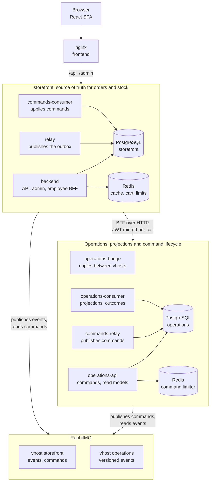

# Asian Restaurant

Food ordering for a pan-Asian restaurant by [mailorq](https://github.com/mailorq): a storefront with a menu, a
server-side cart and checkout, and an employee panel that moves orders through their statuses.

Two Django services and a React SPA:

- **storefront** (`backend/`) owns customers, the menu, stock, carts and orders. It serves the public API, the
  Django admin and the employee panel's API, and it is the only process that writes an order.
- **Operations** (`services/order_operations/`) keeps its own read models of orders, customers and stock, and the
  lifecycle of employee commands. It never touches the storefront database.
- **frontend** (`frontend/`) is the React SPA for customers and employees, served by nginx.

There is no public hosting yet. Everything below runs locally or on disposable Docker Compose stands. TLS
termination by an ingress in front of nginx is a requirement of a future deployment, not a running component
(see [DEPLOY.md](DEPLOY.md)).

## Tech stack

| Layer | Technology |
|---|---|
| Frontend | React 18, TypeScript, Vite, Tailwind CSS 4, TanStack Query, Zustand |
| Backend | Python 3.13, Django 5.2, django-ninja, gunicorn with uvicorn workers |
| Storage | PostgreSQL 16 (one database per service), Redis 7 (one instance per service) |
| Messaging | RabbitMQ 4.3, two vhosts, transactional outboxes on both sides |
| Infra | Docker Compose, nginx, Prometheus |
| Quality | pytest, ruff, `node --test`, uv lock files, GitHub Actions, production render gate and Compose smokes |

## Architecture



Arrows point from a component to what it connects to. An employee does not change an order in one request: the
panel posts to the storefront, whose BFF mints a short-lived JWT and creates a command in operations-api, and the
answer is `202` with a command id (`200` with the same command for a repeat). The order changes later:
commands-relay publishes the request from the Operations outbox, and commands-consumer in the storefront applies
it under a lock on the order after checking the expected status. The outcome is written to the storefront outbox
in the same transaction and travels through the relay and operations-bridge to operations-consumer, which
finalizes the command, so the panel follows the command status instead of expecting an immediate answer. The
storefront database stays the source of truth for orders and stock; RabbitMQ only carries messages from the
outboxes to the consumers.

## Order flow

1. A signed-in customer checks out the server-side cart. In one storefront transaction the order is created, stock
   is taken under row locks, the address is verified by the geocoder with a cache, and an `order.created` row is
   written to `OrderOutbox`. The checkout is idempotent by its key and by the cart version.
2. The relay publishes outbox rows with publisher confirms, in order per aggregate. The bridge copies them from the
   `storefront` vhost to the `operations` vhost, and operations-consumer updates the Operations projections.
3. An employee confirms the order. For an employee switched to the command plane this is the command path above;
   for everyone else it is a direct transition in the storefront under the same lock and `expected_status`
   check, so both paths can coexist on one order without applying twice.
4. Every status change is a new version of the order aggregate and reaches Operations the same way as step 2.

## Commands: idempotency and states

- One employee action is one `Idempotency-Key`. Operations identifies a command by
  `(actor, command type, order, key)`: a repeat returns the existing command, the same key with another intent is
  `409`. The storefront BFF keeps no state about repeats ([ADR-0002](packages/event_contracts/docs/ADR-0002-bff-retry-state.md)).
- New commands are limited per employee and per employee and order in the Operations Redis; a repeat is never
  charged, a refusal is `429` with `Retry-After`, and without the limiter store a new command is `503`.
- `pending` and `dispatched` are on their way. `succeeded` and `rejected` are final. `timed_out` and
  `dispatch_failed` are not final: a late outcome can still finish the command, otherwise an operator decides with
  `resolve_command` ([runbook-0008](services/order_operations/docs/runbook-0008-command-plane.md)).
- The panel stores an unresolved action with its key in the browser and offers to continue it after a lost answer
  or a reload, always under the same key.

The full design of the command plane: [ADR-0001](packages/event_contracts/docs/ADR-0001-order-transition-command-plane.md).

## Roles and access

| Role | Access |
|---|---|
| customer | own cart, checkout, own order history |
| `restaurant_operator` | order queue and status changes |
| `restaurant_manager` | operator access plus stock and customer data |
| superuser | everything, and the only one who grants staff roles |

- An employee holds exactly one role; two role groups at once close access instead of widening it. `is_staff` alone
  grants nothing. Every role change is recorded in `EmployeeRoleAudit`.
- The storefront signs employee JWTs for Operations, which checks them against the storefront JWKS and accepts a
  token only if its authorization version matches its own projection of the employee, so a revoked role stops
  working before the token expires.
- The panel never holds an Operations token: the BFF mints one per call. `POST /api/auth/employee-token` still
  issues a token to a signed-in employee for direct Operations access; whether it stays is an open decision.
- `transitions_via_commands` switches an employee to the command plane. The direct transition endpoint and the
  admin transition actions are then closed to that employee, and a panel opened before the switch learns it from
  `403 transition_mode_changed`.

## Getting started

Requirements: Docker with Compose v2, bash and openssl (Git Bash works on Windows). For the frontend tools outside
Docker, Node.js 20+; for the Python tools, [uv](https://docs.astral.sh/uv/).

```bash
cp .env.example .env
cp compose.override.example.yaml compose.override.yaml
bash scripts/dev_gen_jwt_key.sh
docker compose up -d --build
```

The override runs the backend with `runserver` and the frontend with Vite, both with the source mounted.
Migrations run as the one-shot `storefront-migrate` and `operations-migrate` jobs before anything else starts.
The development stack also starts `ops`, a legacy projection consumer of the storefront that production does not
run.

```bash
# catalog and initial stock, once per new database
docker compose exec backend python manage.py seed_menu
docker compose exec backend python manage.py seed_initial_stock --confirm --quantity 50

# a superuser who grants staff roles
docker compose exec backend python manage.py createsuperuser --username +380671112244
```

An employee signs up on the site like a customer, here with the phone `+380671112233`, and then gets a role:

```bash
docker compose exec backend python manage.py grant_employee +380671112233 --role restaurant_manager --actor +380671112244
# optional: move that employee to the command plane
docker compose exec backend python manage.py transitions_via_commands +380671112233
```

| What | Where |
|---|---|
| Storefront and employee panel | http://localhost:5173 |
| API docs (development only) | http://localhost:8000/api/docs |
| Django admin | http://localhost:8000/admin/ |
| RabbitMQ management | http://localhost:15672 |
| Prometheus | http://localhost:9090 |

## Testing

```bash
# frontend: types, unit tests of the command flow, production build
cd frontend && npm ci && npm run lint && npm test && npm run build && cd ..

# shared event contracts
cd packages/event_contracts && uv sync --locked && uv run --locked pytest -q && cd ../..

# storefront, inside the development stack started above (its image carries the dev dependency group)
docker compose exec backend pytest

# Operations, on the test overlay in a project of its own: the dev image with the source mounted
docker compose -p asian-restaurant-ops-test -f compose.yaml -f compose.test.yaml up -d --build operations-api
docker compose -p asian-restaurant-ops-test -f compose.yaml -f compose.test.yaml exec operations-api pytest
docker compose -p asian-restaurant-ops-test -f compose.yaml -f compose.test.yaml down -v
```

The test overlay gets its own project because it replaces operations-api and the broker without the development
override, and the database provisioning refuses to run while the development stack is connected.

Production render and disposable stands, each in its own Compose project:

```bash
bash scripts/check_prod_config.sh             # the production render gate
bash scripts/stack_smoke.sh                   # nginx, prometheus, networks and the command plane on a released stack
bash scripts/restore_rehearsal.sh             # backup in a maintenance window, restore into an empty stack
E2E_ALLOW_DESTRUCTIVE=1 bash scripts/e2e_reconcile.sh
```

CI runs the Python suites with `uv sync --locked` against real PostgreSQL, Redis and RabbitMQ, the frontend checks,
the gate, the broker permission test and the production bootstrap, database roles, operations pool and stack smokes:
[.github/workflows/ci.yml](.github/workflows/ci.yml). The restore rehearsal and the e2e run are local only.

## Repository layout

```
.
├── backend/                  # storefront: Django project
│   ├── accounts/             # users, staff roles, audit, employee JWT
│   ├── menu/                 # catalog, stock, stock adjustments
│   ├── cart/                 # server-side cart in Redis
│   ├── orders/               # checkout, orders, geocoder, outbox, command consumer
│   ├── employee/             # employee panel API and the command BFF
│   ├── ops/                  # legacy order projection, development stack only
│   ├── config/               # settings, API root, workers
│   └── seed/                 # menu seed data and product photos with their sha256
├── services/order_operations/  # Operations: projections, command API, relays, bridge
├── packages/event_contracts/ # event and command contracts shared by both services
├── frontend/                 # React SPA and its nginx config
├── ops/                      # postgres roles, rabbitmq provisioning, prometheus, identity keys
├── scripts/                  # production gate, smokes, restore rehearsal
├── compose.yaml              # the stack
├── compose.prod.yaml         # production overlay
├── compose.override.example.yaml  # development overlay template
└── DEPLOY.md                 # release, secrets, network model, backup, operations
```

## Documentation

- [DEPLOY.md](DEPLOY.md) - release order, secrets, database roles, ingress requirements, network model, backup
  and restore, image pinning.
- [ADR-0001](packages/event_contracts/docs/ADR-0001-order-transition-command-plane.md) - the order transition
  command plane.
- [ADR-0002](packages/event_contracts/docs/ADR-0002-bff-retry-state.md) - why the BFF keeps no retry state.
- [runbook-0008](services/order_operations/docs/runbook-0008-command-plane.md) - commands that need an operator.
- [services/order_operations/README.md](services/order_operations/README.md) - the Operations service.
- [ops/rabbitmq/README.md](ops/rabbitmq/README.md), [ops/identity/README.md](ops/identity/README.md) - broker
  provisioning and signing keys.

## Author

- [mailor](https://github.com/mailorq) - fullstack
